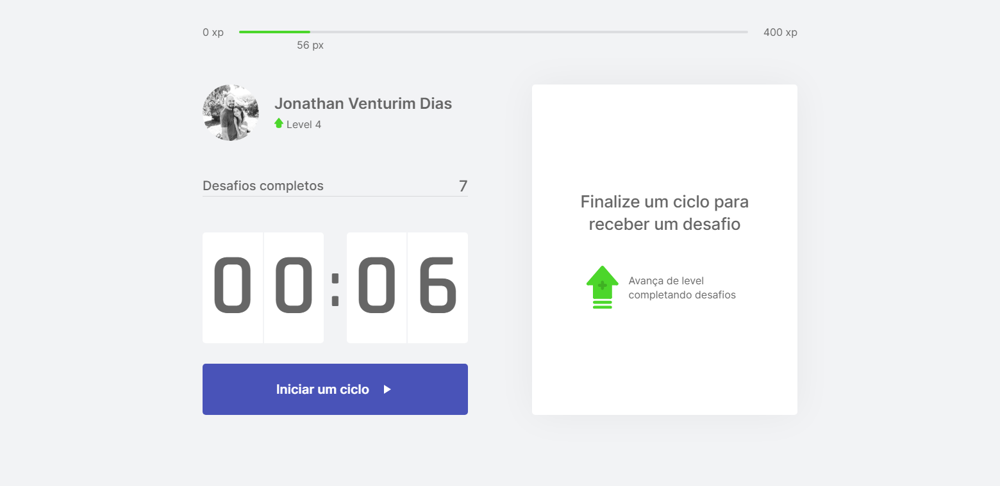
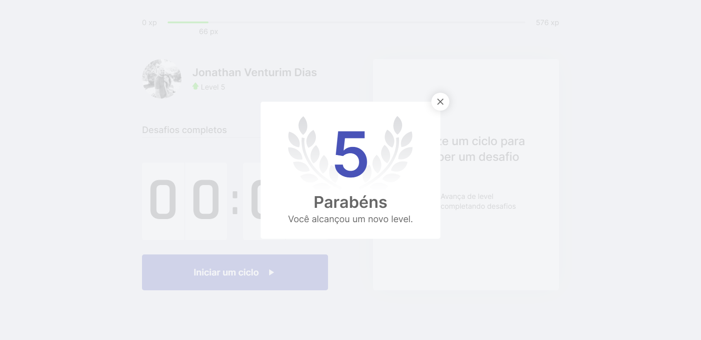

    

    
    

# NLW#4
🚀🚀🚀 Semana NLW #4 ministrado por Diego Fernandes - CEO da Rocketseat

## Tecnologia: 
- next.js
- typescripts
- contexto para gerenciar estado
- deploy na vercel

[Projeto moveit](https://moveit-next-beta.vercel.app)
